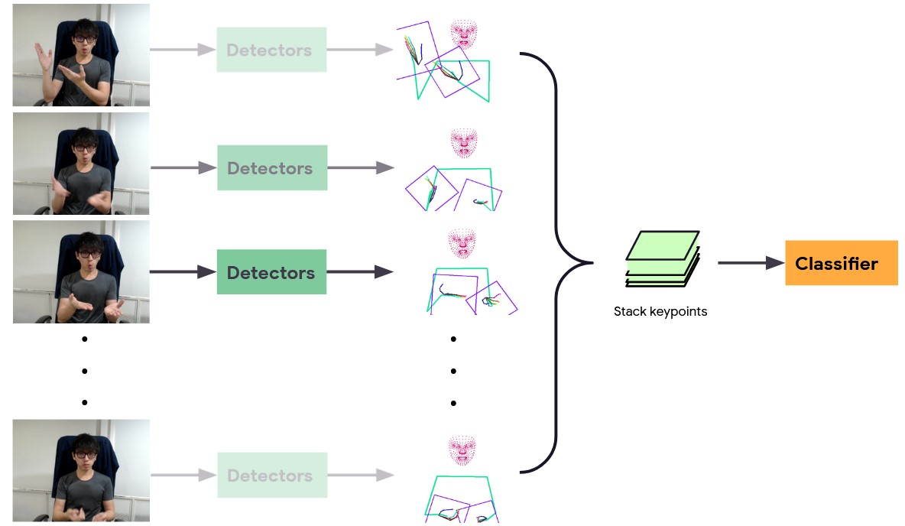
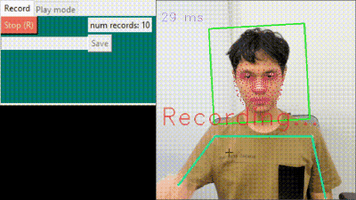
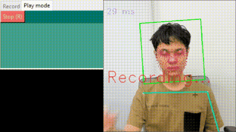

# Shuwa Gesture Toolkit

Shuwa (手話) is Japanese for "Sign Language"

Shuwa Gesture Toolkit is a framework that detects and classifies arbitrary gestures in short videos. It is particularly useful for recognizing basic words in sign language. We collected thousands of example videos of people signing Japanese Sign Language (JSL) and Hong Kong Sign Language (HKSL) to train the baseline model for recognizing gestures and facial expressions.

The Shuwa Gesture Toolkit also allows you to train new gestures, so it can be trained to recognize any sign from any sign language in the world.

[[Web Demo](https://shuwa-io-demo.uc.r.appspot.com/)]

# How it works

  
by combining the results of a [Holistic](https://google.github.io/mediapipe/solutions/holistic.html) model over multiple frames. We can create a reasonable set of requirements for interpreting sign language, which include body language, facial expression, and hand gestures.


The next step is to predict the sign features vector using a classifier model. Lastly, output the class prediction using K-Nearest Neighbor classification.


# Installation

- Install python 3.9
- Install dependencies
  ```
  pip3 install -r requirements.txt 
  ```

# Run demo

```
python3 webcam_demo.py
```

- Use record mode to add more sign.  
  

- Play mode.  
  

# Try Hong Kong Sign Language or Japanese Sign Language

1. Download [hksl_jsl_samples.zip](https://storage.googleapis.com/bit-studio-static/jobs/shuwa/hksl_jsl_samples.zip) 
2. Extract to root directory
3. run 
    ```
    python3 webcam_demo.py
    ```


# Train classifier

You can add a custom sign by using Record mode in the full demo program.  
But if you want to train the classifier from scratch you can check out the process [`here`](/notebooks/train_translator.ipynb)
